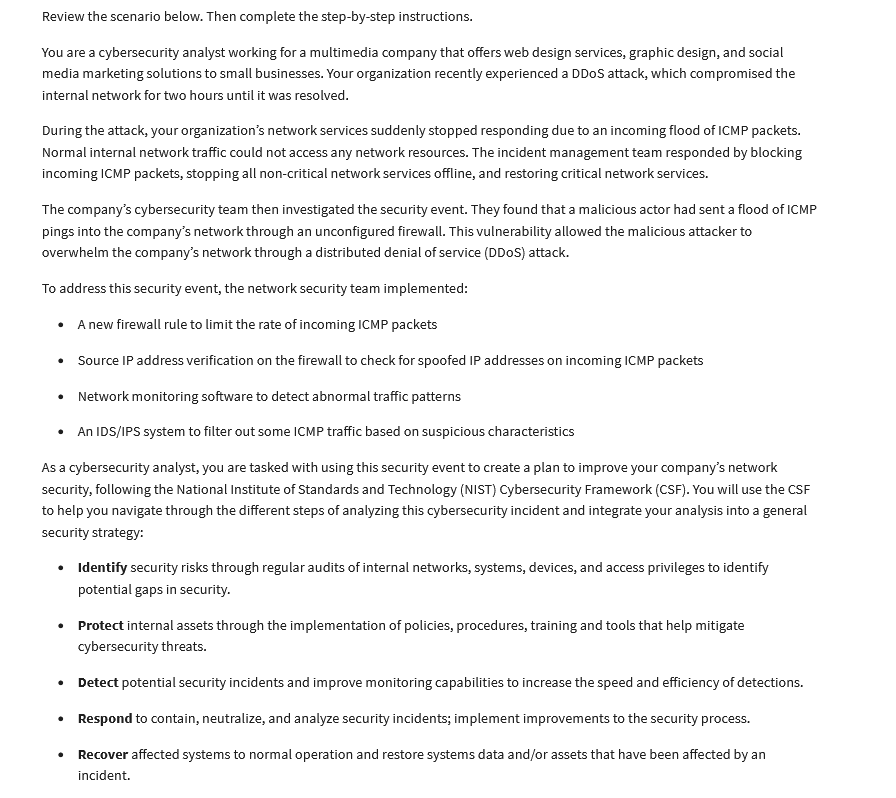

# Google-Cert-Use-the-NIST-framework
A project made in Google Cybersecurity Certificate.

In the Google Cybersecurity Certificate I got a task to create a security plan using NIST CSF framework. 

I was given a scenario:

All the work is saved in PDF file "Incident report analysist using NIST CSF Framework".
